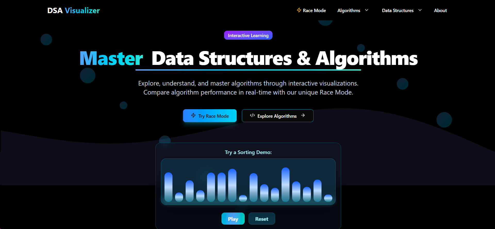

# 🚀 DSA Visualizer

<div align="center">
  
  
  
  
  
  

  <h3>✨ Interactive Data Structures & Algorithms Visualizer ✨</h3>
  
  <p>Master complex DSA concepts through beautiful, interactive visualizations and real-time algorithm racing!</p>

  **🌐 [Live Demo](https://dsa-visualizer-sr27.vercel.app/) | 📚 [Documentation](#-features) | 🐛 [Report Bug](https://github.com/nikhilsaini2/DSA-VISUALIZER/issues)**

</div>

---

## 📸 Project Preview

<div align="center">
  
  <br><br>
  <p><em>🎯 Interactive learning with beautiful visualizations and real-time Race Mode!</em></p>
  <p><strong>✨ Features: Sorting Demo, Race Mode, Interactive Controls, Dark Theme</strong></p>
</div>

<br>

## ⭐ Key Features

<table>
<tr>
<td>

### 🎯 **Algorithm Visualizations**
- **Sorting Algorithms**: Bubble, Merge, Quick, Heap Sort
- **Searching Algorithms**: Binary, Linear Search
- **Graph Algorithms**: BFS, DFS, Dijkstra's
- **Dynamic Programming**: Fibonacci, Knapsack, LCS

</td>
<td>

### 🏁 **Race Mode**
- Compare multiple algorithms side-by-side
- Real-time performance metrics
- Interactive speed controls
- Visual performance analysis

</td>
</tr>
<tr>
<td>

### 📊 **Data Structures**
- Arrays, Stacks, Queues
- Linked Lists (Singly, Doubly)
- Trees and Graph representations
- Interactive manipulation tools

</td>
<td>

### 🎨 **Modern UI/UX**
- Dark mode support
- Responsive design
- Smooth animations
- Intuitive controls

</td>
</tr>
</table>

---

## 🛠️ Tech Stack

<div align="center">

| Frontend | UI/Styling | Tools & Deployment |
|----------|------------|-------------------|
|  |  |  |
|  |  |  |
| React Router | Radix UI | ESLint |
| Framer Motion | Lucide React | Git |

</div>

---

## 🚀 Quick Start

### Prerequisites
- **Node.js** (v18.0.0 or higher)
- **npm** or **yarn**

### Installation

1. **Clone the repository**
   ```bash
   git clone https://github.com/nikhilsaini2/DSA-VISUALIZER.git
   cd DSA-VISUALIZER
   ```

2. **Install dependencies**
   ```bash
   npm install
   # or
   yarn install
   ```

3. **Start development server**
   ```bash
   npm run dev
   # or
   yarn dev
   ```

4. **Build for production**
   ```bash
   npm run build
   # or
   yarn build
   ```

---

## 📱 Screenshots

<div align="center">
  
  
</div>

<div align="center">
  
  
</div>

---

## 🤝 Contributing

We welcome contributions from the community! Here's how you can help:

<details>
<summary><b>🔧 Development Guidelines</b></summary>

1. **Fork the repository**
2. **Create a feature branch**
   ```bash
   git checkout -b feature/amazing-feature
   ```
3. **Commit your changes**
   ```bash
   git commit -m 'Add some amazing feature'
   ```
4. **Push to the branch**
   ```bash
   git push origin feature/amazing-feature
   ```
5. **Open a Pull Request**

</details>

<details>
<summary><b>🐛 Bug Reports</b></summary>

Found a bug? Please open an issue with:
- Bug description
- Steps to reproduce
- Expected vs actual behavior
- Screenshots (if applicable)

</details>

---

## 🎯 Roadmap

- [ ] **Advanced Graph Algorithms** (Kruskal's, Prim's)
- [ ] **Tree Visualizations** (AVL, Red-Black Trees)
- [ ] **String Algorithms** (KMP, Rabin-Karp)
- [ ] **Code Export Feature** 
- [ ] **Algorithm Complexity Analysis**
- [ ] **Mobile App Version**
- [ ] **Multi-language Support**

---

## 👨‍💻 Author

<div align="center">
  
  **Nikhil Saini**
  
  [](https://github.com/nikhilsaini2)
  [](https://www.linkedin.com/in/nikhilsaini2/)
  [](https://your-portfolio-link.com)

</div>

---

## 📄 License

This project is licensed under the MIT License - see the [LICENSE](LICENSE) file for details.

---

## ⭐ Show Your Support

If you found this project helpful, please consider giving it a ⭐ on GitHub!

<div align="center">
  
  **Made with ❤️ by [Nikhil Saini](https://github.com/nikhilsaini2)** | **Professional DSA Visualizer by Nikhil Saini**
  
  [](https://github.com/nikhilsaini2/DSA-VISUALIZER/stargazers)
  [](https://github.com/nikhilsaini2/DSA-VISUALIZER/network/members)

</div>
